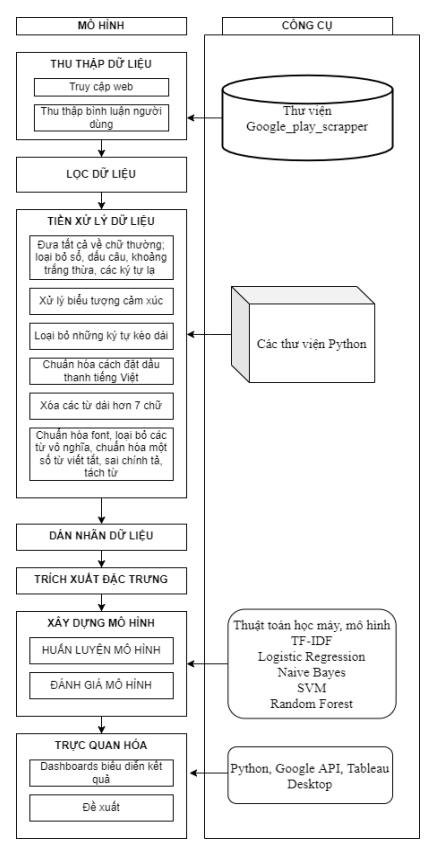
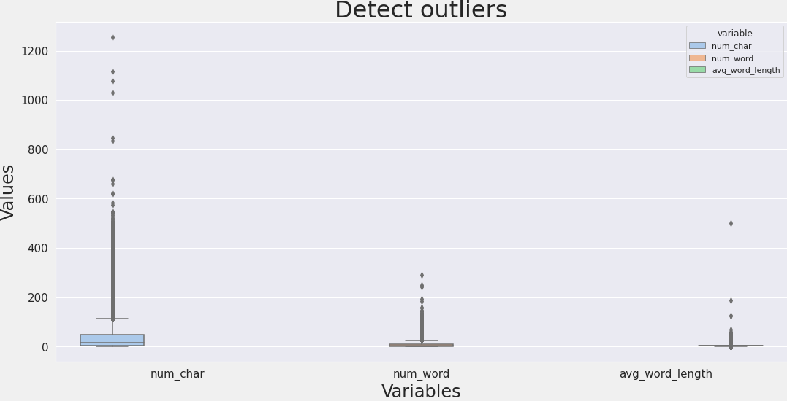
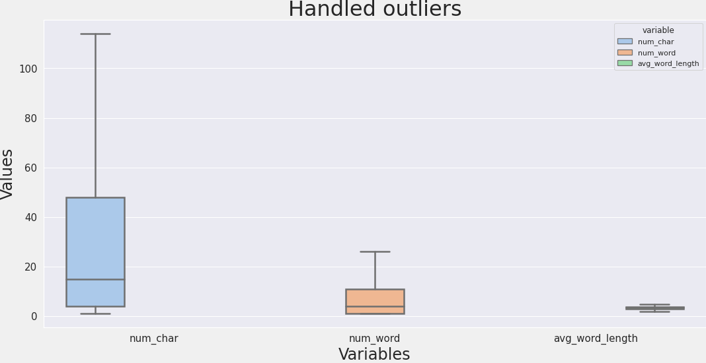
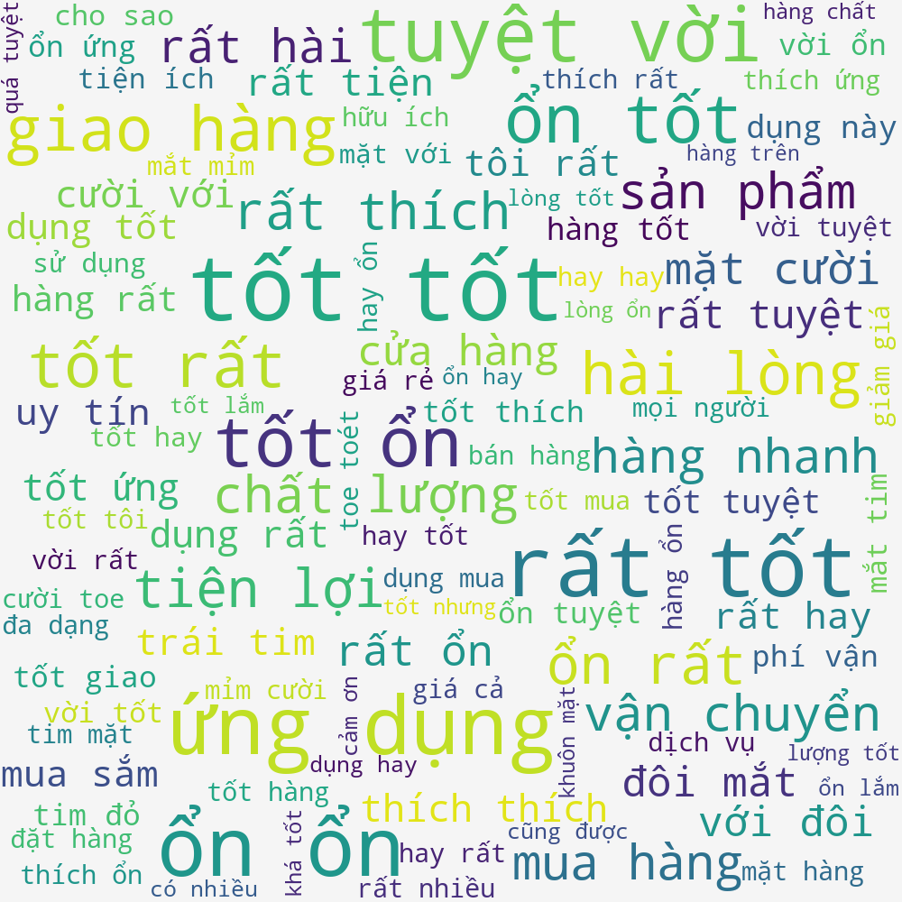
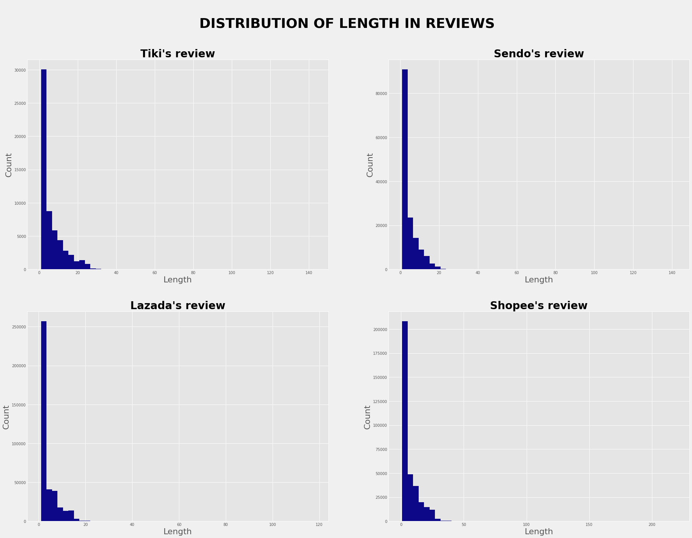
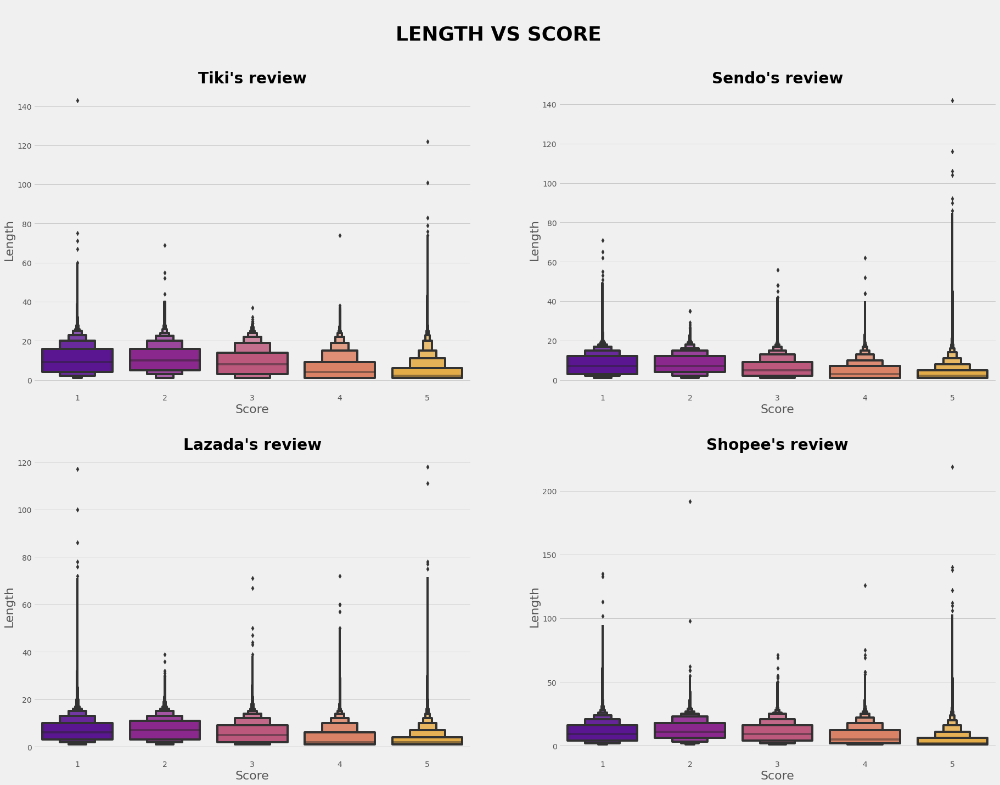

# [Customer experience discovery model based on sentiment analysis and machine learning method](https://github.com/trannhatnguyen2/RS_SentimentAnalysis_2022)

## Member of group

### **`Deadline`**

| student_id | class   | full_name              | role   |
| ---------- | ------- | ---------------------- | ------ |
| K204060307 | K20406C | Nguyen Tran Thuy Quynh | Leader |
| K204060288 | K20406  | Bui Nguyen Bich Ngoc   | Member |
| K204110588 | K20411  | Nguyen Thi Bao Tram    | Member |
| K204061440 | K20406T | Tran Nhat Nguyen       | Member |
| K204060299 | K20406  | Vo Ba Tung             | Member |

# 📕 Table of contents

<!--ts-->

- 🛠️ [Introduction](#️-introduction)
- 🧙‍♂️ [Proposed Model](#-proposed-model)
- 🚀 [Experiment](#-experiment)
- 📊 [Result](#️-result)
- 🌟 [Publication](#-publication)
<!--te-->

# 🛠️ Introduction

Understanding customer psychology is one of the key issues in a business's long-term development strategy, helping to build trust with customers and enhance the business's competitive advantage in the market. With the strong development of technology, the number of online users is increasing rapidly, and interactions and comments on the internet have become a very important source of practical data, supporting the exploration of user behavior and psychology. The study aims to analyze positive or negative customer opinions through comments in the mobile commerce field based on the combination of supervised machine learning methods and natural language processing techniques. Additionally, the model's performance is evaluated through a confusion matrix to ensure the reliability of the results.

# 🧙‍♂️ Proposed Model

    Proposed Model

# 🚀 Experiment

## [Data Collection]()

The data was collected from four major mobile commerce applications in Vietnam, including Tiki, Shopee, Lazada, and Sendo, with over 1,000,000 customer comments.

| userName   | content                  | at         | score | thumbsUpCount | address |
| ---------- | ------------------------ | ---------- | ----- | ------------- | ------- |
| Lợi Thị Lê | Uy tín chất lượng        | 01/12/2021 | 5     | 2             | Lazada  |
| Cường Trần | Ok                       | 01/12/2021 | 4     | 0             | Sendo   |
| Bảo Nguyễn | Shopee siêu xịn luôn ạ!! | 02/12/2021 | 5     | 10            | Shopee  |
| Thư Ngọc   | trang mua sắm tiện lợi   | 06/12/2021 | 5     | 0             | Tiki    |

## [Exploratory Data Analysis (EDA)](https://github.com/trannhatnguyen2/RS_SentimentAnalysis_2022/blob/main/src/get_review_app.ipynb)

EDA is the process of summarizing a dataset in a general way, identifying the main characteristics of the data, often using statistical graphics and other intuitive data visualization methods.

    Detect Outlier

We filtered out outliers that fell outside the upper and lower fences of the collected ratings by removing the outliers and replacing them with the IQR to improve the performance and reliability of the models.

    Handle Outlier

## [Pre-processing](https://github.com/trannhatnguyen2/RS_SentimentAnalysis_2022/blob/main/src/pre-processing.ipynb)

When collecting datasets from mobile commerce applications, the data is in raw form (not yet processed, with some fields empty, misspelled, containing special characters or emoticons, etc.), and this data can reduce the accuracy of the results of the models.

| Before                                    | After                                   |
| ----------------------------------------- | --------------------------------------- |
| Đúng nơi mua sắm cho mọi người            | đúng nơi mua_sắm cho mọi người          |
| Hài lòng!!!                               | hài_lòng                                |
| OK!Rất tốt! Rất hài lòng về cách phục vụ! | ổn rất tốt rất hài_lòng về cách phục_vụ |
| Phí ship quá đắt                          | phí vận chuyển quá đắt                  |

## Data Label

| userName   | content                | at         | score | thumbsUpCount | address | label |
| ---------- | ---------------------- | ---------- | ----- | ------------- | ------- | ----- |
| Lợi Thị Lê | hài_lòng               | 10/11/2021 | 5     | 4             | Lazada  | Pos   |
| Cường Trần | ổn                     | 12/11/2021 | 4     | 0             | Sendo   | Pos   |
| Bảo Nguyễn | phí vận chuyển quá đắt | 15/11/2021 | 1     | 5             | Shopee  | Neg   |
| Thư Ngọc   | trang mua_sắm tiện lợi | 20/11/2021 | 5     | 0             | Tiki    | Pos   |

## [Feature Extraction](https://github.com/trannhatnguyen2/RS_SentimentAnalysis_2022/blob/main/src/feature_extraction_%26_algorithms.ipynb)

The TF-IDF feature extraction method is applied to build a weight vector that represents the frequency of word occurrence in customer comments.

## [Model Evaluation](https://github.com/trannhatnguyen2/RS_SentimentAnalysis_2022/blob/main/src/feature_extraction_%26_algorithms.ipynb)

| ML  | Precision | Recall | F_score | Accuracy | Training Time | Prediction Time |
| --- | --------- | ------ | ------- | -------- | ------------- | --------------- |
| LR  | 0.93      | 0.96   | 0.95    | 0.91     | 17,8s         | 1,3s            |
| SVM | 0.93      | 0.96   | 0.95    | 0.91     | 17h38m47s     | 28m16s          |
| NB  | 0.94      | 0.94   | 0.94    | 0.90     | 9,04s         | 1,33s           |
| RF  | 0.94      | 0.96   | 0.95    | 0.92     | 41m4s         | 24,3s           |

Based on the evaluation metrics above, we believe that the Logistic Regression algorithm is the most suitable for the dataset we collected.

# 📊 Result

    WordCloud Positive

    Distribution of Length

    The relationship between the length and the rating score

# 🌟 Publication

Quynh Nguyen Tran Thuy, Ngoc Bui Nguyen Bich, Tram Nguyen Thi Bao, Nguyen Tran Nhat, Tung Vo Ba, Customer experience discovery model based on sentiment analysis and machine learning method, VNUHCM Journal of Economics, Business and Law, 6(3), 3277-3290. https://doi.org/10.32508/stdjelm.v6i3.1030

---

&copy; 2022 Deadline

